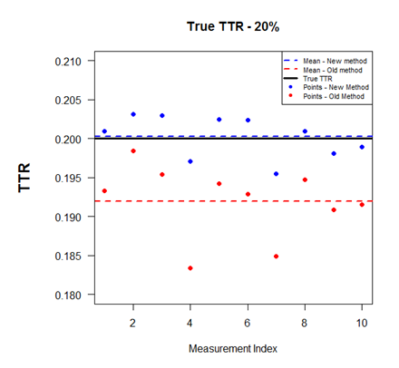

## 1. Project Summary

Developments in the understanding of the stress response to massive burns have led to a
significant reduction in mortality. However, burn survivors develop several metabolic
abnormalities and arguably the most detrimental is excessive muscle wasting.  Burn-induced
muscle catabolism leads to reduced strength, delayed rehabilitation, increased morbidity
and mortality. Skeletal muscle serves as a protein depot to buffer plasma amino acid
concentrations due to heightened demand for acute phase protein synthesis and wound
healing.

Assessment of muscle wasting requires the accurate evaluation of the protein synthesis and
breakdown. Measurement of protein kinetics are optimal for mechanistic investigations on
the molecular mechanism of muscle wasting and for evaluating the acute effect on protein
turnover of various therapeutic agents.  Therefore, high precision in protein kinetics
estimation is of primary importance. Stable isotope methods are currently the most
accurate and least invasive approach in vivo. Current methodology is based on radioactive
isotope methods where the tracer amount used is practically massless; therefore,
adaptations have been made to increase the validity of stable isotopes methods.  Despite
the corrections, experimental measurements often deviate from the theoretically expected
values. All stable isotope techniques depend on the accuracy of the stable isotope
enrichments in circulatory blood and tissues, especially in very low enrichments such as
diluted by high food intake. A minor error in the calculation of enrichment could lead to
significant errors in the final results, particularly in the calculation involving decay
kinetics.

In Shriners Hospitals for Children in Galveston, hundreds of stable isotope metabolic
studies have been conducted over the last two decades, measuring protein kinetics in
severely burn pediatric patients. While metabolic study protocols were similar, patients
were studied under varying nutritional conditions therefore the effect of protein intake
during metabolic study on protein kinetics can be examined. Our specific aims are as
follows:

**Aim 1:** Increase the precision of mass spectrometry isotope enrichment estimation of
patient samples by:

1. Establishing a method for the statistical derivation of the isotopic purity of the
   tracer.
2. Modeling the observed mass spectrum, using the statistical properties of the mass
   distribution of tracee and tracer.

## 2. Specific Aims

**Aim 1:** Increase the precision of mass spectrometry isotope enrichment estimation of
patient samples by:

1. Establishing a method for the statistical derivation of the isotopic purity of the tracer.
  * The effect of labeling on the skewness of tracer’s mass distribution is usually underestimated. Obtaining an accurate estimate of the tracer’s isotopic purity is expected to increase accuracy in enrichment estimation.

2. Modeling the observed mass spectrum, using the statistical properties of the mass distribution of tracee and tracer. 
  * The methods used for calculation of enrichment for mass spectrometry reading do not take
into account the statistical properties of the mass distributions of tracee and tracers. 
Using this additional information is expected increase precision in enrichment estimation. 

## 3. Research Strategy

### A. *Significance*

Detailed assessment of the severity of muscle wasting in burn patients requires the
accurate evaluation of the muscle protein synthesis and breakdown. In vivo measurement of
protein kinetics is optimal for mechanistic investigations on the molecular mechanism of
muscle wasting and for evaluating the acute effect on protein turnover of various
therapeutic agents. Therefore, <u>high precision and accuracy in protein kinetics
measurements is of primary importance</u>.

Stable isotope methods are currently the most feasible (noninvasive) and accurate in vivo
approach to estimate protein kinetics in burn patients(1). The isotopic distribution of
atoms in nature (tracee) does not vary much and is well recorded. In metabolic research
tracers are molecules where several atoms on their structure have been artificially
exchanged with heavier (usually by 1 neutron) isotopes of the same atoms(2). The
determination of substrate kinetics is possible through the measurement of enrichment
(ratio of tracer-to-tracee) over time.

The attachment of heavier atoms on tracers does not only cause a shift in mass
distribution but also changes of skewness of the distribution. The difference in the
skewness of mass distributions of tracee and tracer can be amplified by the degree of
tracer’s isotopic purity. A tracer with 99% isotopic purity does not mean that 99% of the
molecules are labeled and 1% is not.  It means that each labeled atom has 99% change of
being actually exchanged with the heavier isotope. For example, in a sample of tracer
molecules, having 10 labeled atoms with 99% isotopic purity, only 0.9910 = 90.4% of the
molecules will have all 10 atoms labeled.

Currently, methods for the calculation of enrichment from mass spectrometry data(2,3)
either underestimate the effect of labeling on tracer’s mass distribution, leading to
biased estimates, or/and ignore statistical properties of tracee and tracer mass
distribution leading to increased variability. A method that takes into account both
factors is expected to <u>improve the accuracy and precision of enrichment estimation</u>.

### *B. Preliminary Studies*

These preliminary data were included in abstract presentation Experimental Biology 2018,
San Diego, California.
> **Malagaris I**., Porter C., Herndon DN., Yu YM. “<u>Method for the Improvement of
> Enrichment Estimation in Stable Isotope Metabolic Studies</u>”. Session: “Mathematical
> models of organ systems, tissues or cells”. Experimental Biology 2018, San Diego,
> California

The isotopic purity of the tracer was estimated to be 99.1% and then a mixture with known
enrichment of 20% was prepared. Visual inspection of the figure below shows that the new
method seems to improve accuracy (close to the true enrichment) and precision (low spread
of values)

### *C. Approach*

#### AIM 1

**Atom**        | **Mass Number**      | **Distribution (%)**
  :---          | :---                 | :--- 
**Carbon**      |  12                  | 98.892
\-              |  13                  | 98.892
**Hydrogen**    |  1                   | 99.984 
\-              |  2                   | 0.016
**Nitrogen**    |  14                  | 99.634
\-              |  15                  | 0.016
**Oxygen**      |  16                  | 99.762
\-              |  17                  | 0.038
\-              |  18                  | 0.2
**Silicon**     |  28                  | 92.23
\-              |  29                  | 4.683
\-              |  30                  | 3.087

   
   

**Background:** The main motivation for this aim is that currently the error in enrichment
determination due to the isotopic impurity of the tracers used in kinetics studies is
considered negligible and thus completely ignored. As mentioned in the significance
section, a 99% isotopic purity means that any single labeled atom in the tracer’s has a
probability of 99% to be indeed labeled (17). In Table 2 are displayed the natural
isotopic abundances of atoms that are commonly encountered in metabolic research. The
fractional abundances of atoms are considered constant; thus, according to the table,
98.9% of carbon atoms encountered in nature have Mass Number 12 and only 1.1% have Mass
number 13. The fractional distribution of complex molecules composed of different atoms,
each one having a specific number of naturally occurring isotopic species, can be found by
polynomial expansion, convolution integral or Fast Fourier Transform algorithm (FFT)(18). 

By using computational software the fractional distribution of complex molecules can be
estimated. The input for the algorithm is the chemical formula (type and number of atoms),
and the natural abundance of atoms, which is given in tables as the one displayed above
(16). The chemical formula of the amino acid phenylalanine is $C_9H_{11}NO_2$. GCMS analysis
requires chemical processing of the sample, which results in incorporation of additional
atoms on the molecule. Moreover, the process of ionization results in the breaking of
chemical bonds of the new molecule at specific positions, yielding a characteristic
profile of mass spectrum. One abundant fragment of phenylalanine, has the chemical formula
$C_{17}H_{30}N_1O_2Si_2$. Using an algorithm
written in R programming language, the estimated natural isotopic distribution is the
following.

The corresponding output of GCMS after normalization by setting to 100 the most abundant peak (M0) is shown in the following in Figure1. The chemical formula of this fragment derived from a phenylalanine tracer labeled at six carbon positions is $^{13}C_{ 6 } ^{ 12 }C_{ 11 }H_{ 30 }N_{ 1 }O_{ 2 }Si_{ 2 }$. By assuming the isotopic purity of the tracer at 100% the mass number of the six carbons in the phenylalanine molecule do not follow the binomial distribution mentioned above but are constrained to be $^{ 13 }C$. The estimated mass distribution of this molecule is found in the following table.
  

___
___

